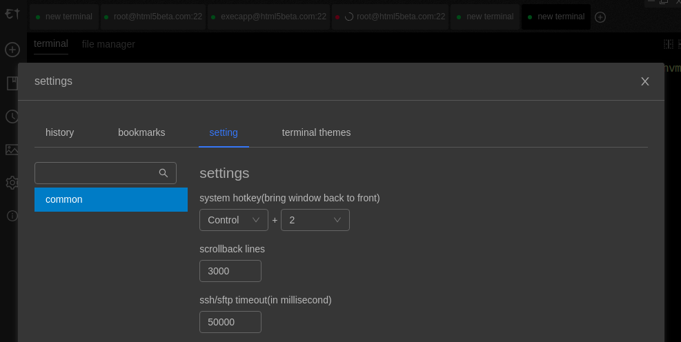

# antd-dark-theme

antd dark theme config. It is used in webpack less loader for antd user. Visit [antd docs](https://ant.design/docs/react/customize-theme) for more detail.



## Use

```bash
npm i -D @electerm/antd-dark-theme
```

```js
// for webpack config
const theme = require('@electerm/antd-dark-theme')
...
  module: {
    rules: [
      {
        test: /\.less$/,
        use: [
          {
            loader: MiniCssExtractPlugin.loader,
            options: {
              // you can specify a publicPath here
              // by default it use publicPath in webpackOptions.output
              publicPath: '../'
            }
          },
          {
            loader: 'css-loader'
          },
          {
            loader: 'less-loader',
            options: {
              javascriptEnabled: true,
              modifyVars: theme
            }
          }
        ]
      },
```

## Realworld Uses

- [electerm](https://github.com/electerm/electerm)

## License

MIT